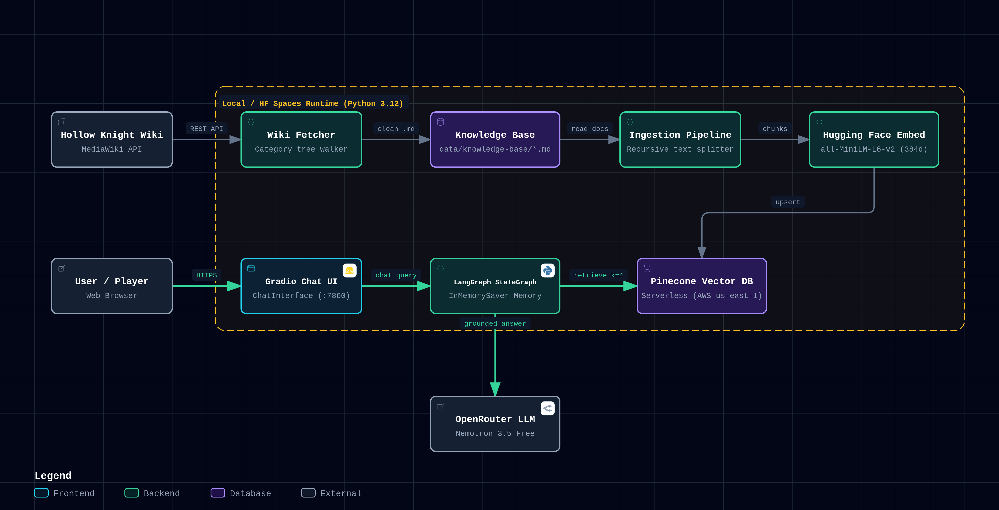

# Hollow Lore Master (LangGraph RAG Edition)

A specialized **Hollow Knight lore Q&A assistant** built with **LangChain & LangGraph**. It scrapes lore directly from the [Hollow Knight Fandom wiki](https://hollowknight.fandom.com), chunks and embeds it into a [Pinecone](https://www.pinecone.io/) Serverless vector database, and answers user questions through a Gradio chat UI — grounded strictly in retrieved lore with explicit source citations.

---

## Architecture



### Core Architecture Components

| Concern | Component | Implementation |
|:---|:---|:---|
| **Chat Model** | `ChatOpenRouter` | `nvidia/nemotron-3.5-lightning:free` (configurable in [`core/config.py`](source/lore_master/core/config.py)) |
| **Orchestration & Memory** | `LangGraph` (`StateGraph`) | Short-term conversational memory managed by `InMemorySaver` checkpointer ([`rag_chat/rag_chain.py`](source/lore_master/rag_chat/rag_chain.py)) |
| **Embeddings** | `HuggingFaceEmbeddings` | `all-MiniLM-L6-v2` (384d, runs locally & free, ~90 MB) |
| **Vector Store** | `PineconeVectorStore` | Serverless index on AWS `us-east-1` (auto-provisioned on boot) |
| **Lore Scraper** | MediaWiki API Crawler | Recursive category tree walker ([`rag_chat/fetch_wiki.py`](source/lore_master/rag_chat/fetch_wiki.py)) |
| **Ingestion Pipeline** | `RecursiveCharacterTextSplitter` | Markdown chunking (`chunk_size=800`, `overlap=150`) → Pinecone upsert ([`rag_chat/ingest.py`](source/lore_master/rag_chat/ingest.py)) |
| **User Interface** | Gradio `gr.ChatInterface` | Session-isolated conversations via `request.session_hash` ([`app.py`](app.py)) |

---

## Short-Term Memory via LangGraph Checkpointer

Rather than relying on an extra LLM round-trip to rewrite user questions (which causes latency, consumes extra tokens, and causes reasoning models like Nemotron to leak internal thought scratchpads), this project uses a **LangGraph StateGraph** coupled with an **`InMemorySaver` checkpointer**:

```
[ User Input ] ────────► [ Retrieve Node ] (Pinecone Vector Search k=4)
                               │
                               ▼
[ InMemorySaver ] ───► [ Generate Node ] (LLM Prompt: Lore Context + History)
(Short-term Memory)            │
                               ▼
                         [ Final Answer ] (Cleaned & Cited)
```

- **Thread-Scoped History**: Every Gradio user session is assigned a unique `thread_id` (via `request.session_hash`). `InMemorySaver` automatically preserves conversation state across turns.
- **Direct Retrieval**: Retrieval queries are issued directly from the user's intent without prompt-rewrite distortion.
- **Thinking Filter**: The pipeline automatically trims `<think>` blocks and reasoning preambles from reasoning models before rendering in the UI.

---

## Getting Started

### Prerequisites
- Python 3.12+
- [uv](https://docs.astral.sh/uv/) (recommended) or standard `pip`
- An [OpenRouter API Key](https://openrouter.ai/)
- A free [Pinecone API Key](https://app.pinecone.io/)

### Installation

```bash
# Clone the repository
git clone https://github.com/nakitadev/hollow-lore-master.git
cd hollow-lore-master

# Create and activate virtual environment with uv
uv venv
source .venv/bin/activate    # Windows: .venv\Scripts\activate

# Install dependencies
uv pip install -r requirements.txt
uv pip install -e .
```

### Environment Configuration

Copy `.env.example` to `.env` and fill in your API keys:

```bash
cp .env.example .env
```

```env
OPENROUTER_API_KEY=your_openrouter_api_key
PINECONE_API_KEY=your_pinecone_api_key
```

> **Note**: You do not need to manually configure indexes in Pinecone. The application auto-provisions the serverless index (`hollow-knight-lore` in `us-east-1`) on first startup if it does not already exist.

---

## Building the Lore Knowledge Base

To scrape lore from the wiki and index it into Pinecone in a single step:

```bash
uv run python scripts/run_fetch_ingest.py
```

This workflow:
1. Crawls the Hollow Knight Fandom wiki starting from `Category:Wiki`, saving sanitized Markdown files to `data/knowledge-base/` mirroring the category tree.
2. Splits documents into 800-character chunks with a 150-character overlap.
3. Generates 384-dimensional dense vectors using `all-MiniLM-L6-v2`.
4. Upserts the vectors into your Pinecone serverless index.

---

## Running the Chatbot

### Locally (CLI / Browser)

```bash
uv run app.py
```

The Gradio web interface will be accessible at `http://localhost:7860`.

---

## Configuration

All system configurations are centralized in [`source/lore_master/core/config.py`](source/lore_master/core/config.py):

```python
@dataclass(frozen=True)
class Settings:
    model: str = "nvidia/nemotron-3.5-lightning:free"  # OpenRouter model ID
    max_tokens: int = 2048                              # Generation token headroom
    temperature: float = 0.2                            # Low temperature for grounded RAG
    retrieval_k: int = 4                                # Retrieved document chunks
    chunk_size: int = 800                               # Splitter chunk size
    chunk_overlap: int = 150                            # Splitter overlap
    knowledge_dir: str = "data/knowledge-base"          # Local raw lore storage
    embedding_model: str = "sentence-transformers/all-MiniLM-L6-v2"
    pinecone_index_name: str = "hollow-knight-lore"
    pinecone_cloud: str = "aws"
    pinecone_region: str = "us-east-1"
```

---

## Deployment to Hugging Face Spaces

The YAML header at the top of this repository enables 1-click deployment to **Hugging Face Spaces**:

1. Create a new Space on Hugging Face using the **Gradio** SDK.
2. Push this repository to your Space remote:
   ```bash
   git remote add space https://huggingface.co/spaces/nakitadev/hollow-lore-master
   git push space main
   ```
3. In your Space's **Settings → Variables and secrets**, add:
   - `OPENROUTER_API_KEY`
   - `PINECONE_API_KEY`
4. On initial container startup, `app.py` checks your Pinecone index. If empty, it automatically runs the ingestion pipeline before launching the Gradio server.

---

## Testing

Run unit tests for offline vector chunking and retrieval:

```bash
uv run python test/test_retriever.py
```

*(Tests use an isolated in-memory Chroma instance to keep testing fast, local, and free without querying Pinecone).*
